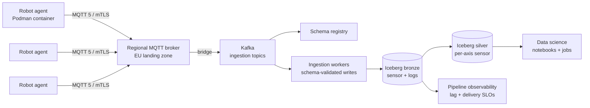

> **This is a fictional worked example.** Apex Robotics, Mira Chen, and all referenced projects/people are invented for the purpose of demonstrating the project structure template. Do not interpret any content as a real Apex Robotics, Legora, or any other company's project.

---

# Apex Robotics — Edge Telemetry Lakehouse (Phase 1)

**Status:** Ready for review · **Owner:** Mira Chen (Staff Engineer, Data Platform) · **Approvers:** David Wu (CTO), Priya Anand (VP Engineering), Tomás Reyes (Head of Fleet Operations)
**Target window:** 2026-06-15 → 2026-12-18
**Prerequisite:** [Fleet OTA v2](https://linear.app/apex/project/fleet-ota-v2-0000) — must hit GA before Phase 1c.

---

## 1. Executive summary

Apex Robotics operates ~3,400 industrial arms across 41 customer factories in the EU and North America. Today each robot writes sensor and log data to a local SQLite ring buffer; field engineers pull it manually during site visits. We have no centralised view of fleet health, no way to train shared anomaly models, and no audit trail for safety incidents. Phase 1 establishes the first cloud-side telemetry path: edge agents stream sensor and log data into a lakehouse that analytics, ML, and customer-facing dashboards can read from.

This document covers Phase 1 only — single tenant (Apex-internal), EU region, sensor + log streams. Multi-tenant customer access, video, and closed-loop control are explicitly out of scope (see §2.2).

**Goals:**

1. Stream ~12 GB/day/robot of sensor + log data from 500 pilot robots to a cloud lakehouse with <60s end-to-end p95 latency.
2. Land data in an open table format so the existing data-science team can query it without a new SDK.
3. Survive a 24h cloud outage with zero on-robot data loss and automatic catch-up replay.
4. Stay under €18k/month all-in for the pilot fleet, with a clear unit-cost model that extrapolates to the full fleet.

**Headline recommendation:** Adopt an MQTT-broker-to-Kafka fan-in with Apache Iceberg as the lakehouse table format, hosted on our existing EU cloud landing zone. Defer the question of a managed lakehouse vendor to Phase 2 once we have a real workload profile.

## 2. Scope

### 2.1 In scope

1. Edge telemetry agent (Rust binary, runs alongside the existing robot control process) for sensor + structured log streams.
2. Regional MQTT broker tier with mTLS client auth, terminating in the EU landing zone.
3. Stream ingestion layer (Kafka) and bronze → silver Iceberg tables in object storage.
4. Schema registry, schema evolution policy, and a code-generated client for the data-science team.
5. Observability for the pipeline itself: broker lag, ingestion lag, write amplification, per-robot delivery SLOs.
6. Onboarding playbook for the 500-robot pilot, including OTA agent rollout and rollback.

### 2.2 Out of scope

- Video and depth-camera streams — owned by [Vision Pipeline](https://linear.app/apex/project/vision-pipeline-0000).
- Customer-facing read access to telemetry — owned by [Customer Insights Portal](https://linear.app/apex/project/customer-insights-portal-0000).
- Closed-loop control or any path where cloud data flows back to influence robot motion — owned by [Cloud-In-The-Loop RFC](https://linear.app/apex/project/cloud-in-the-loop-0000), currently a research project.
- Multi-region failover beyond EU — handled later by [Global Lakehouse Expansion](https://linear.app/apex/project/global-lakehouse-expansion-0000).
- Edge ML inference — owned by [On-Robot Models v1](https://linear.app/apex/project/on-robot-models-v1-0000).

## 3. Decisions requiring approval

| # | Decision | Recommendation |
|---|---|---|
| D1 | Edge → cloud transport: **(a)** MQTT 5 over TLS with a managed broker, **(b)** gRPC bidi streams direct to ingestion, **(c)** AMQP 1.0 via an existing on-prem broker we already license. | **(a) MQTT 5.** Backpressure semantics, persistent sessions, and last-will messages map directly to "robot offline" states; gRPC offers no clean store-and-forward story without us reinventing one. AMQP licence ends Q1 2027. |
| D2 | Lakehouse table format: **(a)** Apache Iceberg, **(b)** Delta Lake, **(c)** Apache Hudi. | **(a) Iceberg.** Open catalog story is the strongest, our data-science team already uses Iceberg in their notebooks, and it avoids coupling to any single vendor for Phase 2. |
| D3 | Edge OS strategy for the telemetry agent: **(a)** ship as a systemd unit on the existing Debian 12 base image, **(b)** ship as a sandboxed container via Podman, **(c)** repackage the robot OS around a minimal immutable base. | **(b) Podman container.** Gives us a clean upgrade boundary without forcing the robot-OS rewrite, which is at least a year out. Acceptable overhead measured at ~40 MB RAM in spike. |
| D4 | Schema evolution policy: **(a)** strict — every change requires a coordinated agent + consumer release, **(b)** backward-compatible only, enforced in CI by the schema registry, **(c)** forward + backward compatible, enforced. | **(b) Backward-compatible only.** Phase 1 has one producer team (us) and one consumer team (data science). Forward compatibility is a Phase 2 problem once customer tenants read directly. |

## 4. Architecture

### 4.1 Strategic shape

Telemetry flows in four hops: **robot → regional broker → ingestion (Kafka) → lakehouse (Iceberg on object storage)**. Each hop owns one job: the broker owns connectivity and store-and-forward semantics; Kafka owns durable ordering and replay; Iceberg owns the table contract that consumers read against. We keep these layers cleanly separated so we can swap any one of them in Phase 2 without re-cutting the others.

### 4.2 Trust and isolation

Each robot has a unique X.509 identity issued by the fleet PKI (see §6). mTLS terminates at the broker; broker-to-Kafka is in a private VPC. The data-science consumer reads Iceberg tables via a read-only catalog role. There is no path from the lakehouse back to the robot — that constraint is enforced by network policy, not just convention.

### 4.3 Data shape

Two logical streams per robot: **sensor** (high-rate, fixed schema, Avro-encoded) and **logs** (lower-rate, structured JSON with a versioned envelope). Both land in bronze Iceberg tables partitioned by ingestion date and robot site. A silver layer flattens sensor events into per-axis columnar tables for the analytics workload; logs stay in bronze for Phase 1.

### 4.4 Diagram

## 5. Phasing

| Phase | Window | Scope | Exit criteria |
|---|---|---|---|
| 1a — Foundations | 2026-06-15 → 2026-07-31 | Landing zone + broker tier stood up; PKI integration; bronze Iceberg tables created; ingestion workers running against a synthetic load generator. | Synthetic load of 500 simulated robots sustained for 72h with <60s p95 ingestion lag and zero data loss across one broker failover. |
| 1b — First 25 robots | 2026-08-03 → 2026-09-11 | Agent shipped via OTA to a 25-robot canary across 3 sites; observability dashboards in production; on-call runbook v1. | 25 robots streaming continuously for 14 days; per-robot delivery SLO ≥ 99.5%; one full broker restart exercised in production with auto-recovery. |
| 1c — Pilot rollout | 2026-09-14 → 2026-11-13 | Rollout to the remaining 475 pilot robots in waves of 50; schema registry enforced in CI; cost model validated against real load. | 500 robots streaming; €/robot/month within ±15% of the Phase 1 forecast; data-science team has run at least 3 production analyses against silver tables. |
| 1d — Hardening + handoff | 2026-11-16 → 2026-12-18 | 24h cloud-outage drill; replay-from-edge tested; runbooks v2; pager rotation handed to Fleet Ops on-call. | Outage drill passes with zero permanent data loss; on-call handover signed off by Fleet Ops; Phase 2 design doc opened. |

## 6. Dependencies

### 6.1 Hard prerequisites

| # | Dependency | Owner | Needed by |
|---|---|---|---|
| P1 | Fleet OTA v2 GA — required to roll the telemetry agent safely with rollback. | [Fleet OTA v2](https://linear.app/apex/project/fleet-ota-v2-0000) — Sara Lindqvist | Phase 1c |
| P2 | EU landing zone with private networking to the existing fleet control plane. | Platform team — Jonas Weber | Phase 1a |
| P3 | Fleet PKI capable of issuing per-robot X.509 certs with automated rotation. | Security team — Aïcha Mansouri | Phase 1a |
| P4 | Schema registry tier in the EU landing zone, with CI enforcement of backward-compat checks. | Data Platform — Mira Chen (this project) | Phase 1b |
| P5 | Object storage with Iceberg-compatible catalog and lifecycle rules for bronze tier (90d hot, 1y warm). | Platform team — Jonas Weber | Phase 1a |

### 6.2 Soft prerequisites

We assume the [Fleet Health Refresh](https://linear.app/apex/project/fleet-health-refresh-0000) team will consume bronze sensor tables for their dashboard, and we have aligned the silver-table schema with their query shape. We also expect [Incident Postmortem Tooling](https://linear.app/apex/project/incident-postmortem-tooling-0000) to integrate against log bronze tables in Q1 2027 — we have not committed to a contract beyond keeping logs queryable for 12 months.

## 7. Top risks

| # | Risk | Mitigation |
|---|---|---|
| R1 | Sustained connectivity loss on robots in remote facilities exhausts the on-edge ring buffer before backfill. | Size on-edge buffer for 72h at p95 sensor rate; alert on >40% buffer fill; document a manual USB-extract escape hatch in the runbook. |
| R2 | Schema drift between the agent and consumers breaks data-science jobs after an agent upgrade. | Enforce backward-compat checks in CI against the registry; gate OTA on a successful schema diff; canary every agent version on 25 robots before fleet rollout. |
| R3 | MQTT broker backpressure during a regional bridge outage causes head-of-line blocking across topics. | Per-topic flow control + per-robot rate caps; spike test at 2× pilot rate; runbook for shedding non-critical log topics first. |
| R4 | Object-storage egress + Kafka inter-AZ traffic blow through the €18k/month budget once we hit 500 robots. | Weekly cost review in Phase 1c; instrument unit cost per robot from day 1; pre-agreed shed-list (e.g. demote some sensor fields to silver-only) if forecast exceeds budget. |
| R5 | Podman container on the robot causes a regression in the existing control process under memory pressure. | Cgroup limits on the telemetry container; soak test on canary robots for 14 days before fleet rollout; auto-disable on three consecutive OOMs. |
| R6 | Iceberg catalog choice in Phase 1 locks us into a vendor by Phase 2. | Use a vendor-neutral REST catalog interface from day 1; explicitly defer managed-vendor selection to Phase 2 (see D2 reasoning). |

## 8. References

- [Fleet OTA v2](https://linear.app/apex/project/fleet-ota-v2-0000) — prerequisite project, owned by Sara Lindqvist.
- [Vision Pipeline](https://linear.app/apex/project/vision-pipeline-0000) — adjacent project, video/depth out of scope here.
- [Customer Insights Portal](https://linear.app/apex/project/customer-insights-portal-0000) — downstream consumer in Phase 2.
- [Cloud-In-The-Loop RFC](https://linear.app/apex/project/cloud-in-the-loop-0000) — research project, explicitly out of scope.
- Apex internal RFC-114: Edge identity and PKI rotation strategy.
- Apex internal RFC-127: Lakehouse table-format evaluation (Iceberg vs Delta vs Hudi).
- [Apache Iceberg specification](https://iceberg.apache.org/spec/) — table format reference.
- [MQTT 5 specification](https://docs.oasis-open.org/mqtt/mqtt/v5.0/mqtt-v5.0.html) — transport reference.

## 9. Sign-off

| Approver | Role | Sign-off | Date |
|---|---|---|---|
| David Wu | CTO | ☐ | |
| Priya Anand | VP Engineering | ☐ | |
| Tomás Reyes | Head of Fleet Operations | ☐ | |

**Decisions D1–D4 require explicit approval before Phase 1a kicks off.**
