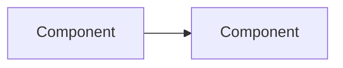

# {Project title}

**Status:** {Draft for circulation / Ready for review / Approved / In flight} · **Owner:** {name} · **Approvers:** {name (role), name (role), name (role)}
**Target window:** {YYYY-MM-DD → YYYY-MM-DD}
**Prerequisite:** {linked project, or "None"}

---

## 1. Executive summary

{One to three paragraphs. State the context, the 2-4 goals (numbered inline in the prose), and the headline recommendation in one sentence. A reader should understand the project from this section alone.}

---

## 2. Scope

### 2.1 In scope

1. {numbered list of in-scope work}
2. ...

### 2.2 Out of scope

- {item} — handled by [{linked project}]({url})
- {item} — deferred to {future phase / project}

---

## 3. Decisions requiring approval

| # | Decision | Recommendation |
|---|---|---|
| **D1** | {choice between (a) / (b) / (c) with one-line description of each} | **{(letter)}** — {short reason} |
| **D2** | ... | ... |

---

## 4. Architecture

{Sub-sections as needed. Include at least one Mermaid diagram for non-trivial designs. Keep strategic — implementation detail belongs in tickets.}

---

## 5. Phasing

| Phase | Window | Scope | Exit criteria |
|---|---|---|---|
| **1a** | {YYYY-MM-DD → YYYY-MM-DD} | {bulleted scope} | {what proves done} |
| **1b** | ... | ... | ... |

Each phase has a go/no-go gate against the previous phase's exit criteria. Only Phase 1a is pre-committed by this plan.

---

## 6. Dependencies

Hard prerequisites for {first committed phase}:

| # | Dependency | Owner |
|---|---|---|
| **P1** | ... | {name or team} |
| **P2** | ... | ... |

Soft prerequisites ({later phases}): {brief notes + cross-links to other Linear projects}

---

## 7. Top risks

| # | Risk | Mitigation |
|---|---|---|
| **R1** | ... | ... |
| **R2** | ... | ... |

---

## 8. References

- {Related Linear projects with links}
- {External docs, RFCs, vendor pages}
- {In-repo docs}

---

## 9. Sign-off

| Approver | Role | Sign-off | Date |
|---|---|---|---|
| {name} | {role} | ☐ | |
| {name} | {role} | ☐ | |

**Decisions D1–D{n} require explicit approval before {first phase} kicks off.**
